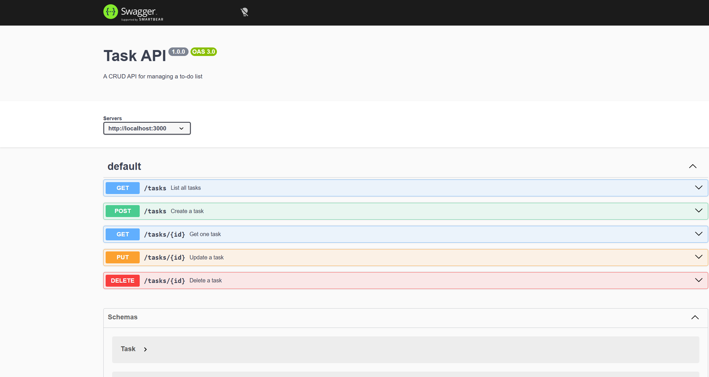

# Task API

A small REST API that manages a to-do list. Built with **Node.js** and **Express** as part of the FlyRank Backend Track (Week 2, Assignment A1).

Tasks are stored in memory — no database. Data resets when the server restarts.

## Quick start

**Prerequisites:** [Node.js](https://nodejs.org/) 18+

```bash
npm install
npm start
```

The server runs at [http://localhost:3000](http://localhost:3000).

Interactive API docs (Swagger UI): [http://localhost:3000/docs](http://localhost:3000/docs)

## Endpoints

| Method | Path | Description | Success |
|--------|------|-------------|---------|
| `GET` | `/` | API info | 200 |
| `GET` | `/health` | Health check | 200 |
| `GET` | `/tasks` | List all tasks | 200 |
| `GET` | `/tasks/:id` | Get one task | 200 / 404 |
| `POST` | `/tasks` | Create a task | 201 / 400 |
| `PUT` | `/tasks/:id` | Update a task | 200 / 400 / 404 |
| `DELETE` | `/tasks/:id` | Delete a task | 204 / 404 |

### Task object

```json
{ "id": 1, "title": "Learn HTTP", "done": true }
```

## Example request

```bash
curl -i http://localhost:3000/tasks/1
```

```
HTTP/1.1 200 OK
X-Powered-By: Express
Content-Type: application/json; charset=utf-8
Content-Length: 41
ETag: W/"29-I/MSs/i3I5NYYLwXrJBQG5e9eMw"
Date: Tue, 14 Jul 2026 19:00:58 GMT
Connection: keep-alive
Keep-Alive: timeout=5

{"id":1,"title":"Learn HTTP","done":true}
```

## Swagger UI



Open [http://localhost:3000/docs](http://localhost:3000/docs) and use **Try it out** to test the full CRUD cycle without curl.

## Tech stack

- Node.js + Express
- In-memory storage
- Swagger UI via `swagger-ui-express` + `openapi.json`
